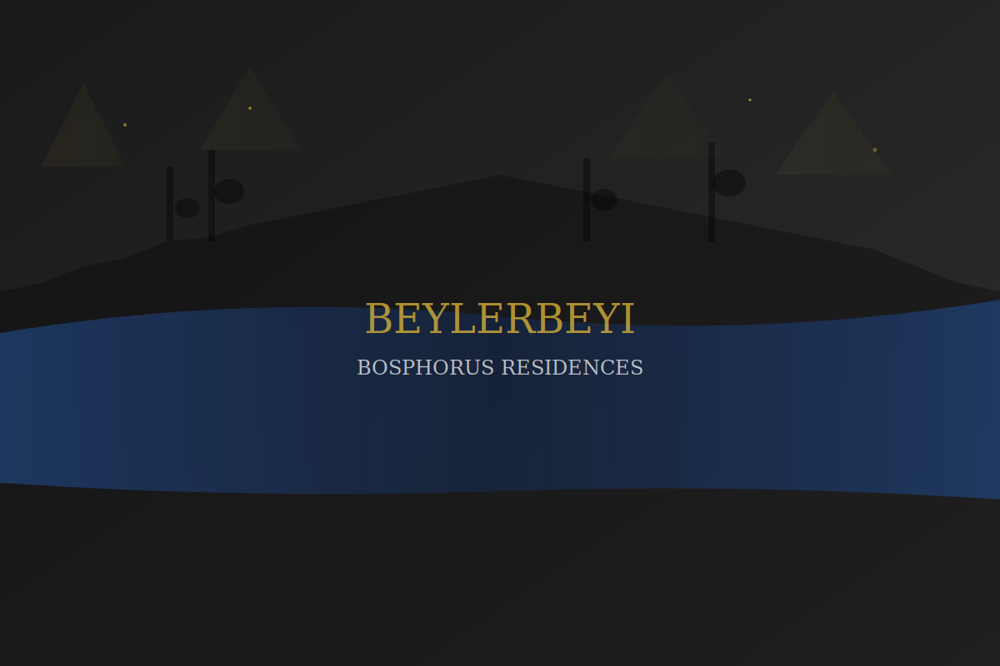

# 🏢 Beylerbeyi Project Landing Page WebApp

A professional real estate landing page for luxury Bosphorus view residences in Beylerbeyi, Istanbul. Built with Flask and featuring multi-language support, advanced form validation, and WhatsApp lead notifications.



## ✨ Features

### 🌐 **Multi-Language Support**
- **Turkish** (Default)
- **English** 
- **Arabic**
- Real-time language switching

### 📱 **Lead Management**
- Professional contact forms with validation
- Quick callback request system ("Ara Beni")
- Email and phone number format validation
- WhatsApp notifications via CallMeBot API
- KVKK (GDPR) compliance

### 🎨 **Modern Design**
- Responsive Bootstrap 5 design
- Auto-rotating hero image slider
- Clean, luxury aesthetic
- Mobile-first approach
- Fast loading with optimized assets

### 🔒 **Security & Compliance**
- Form validation (client + server side)
- Session security
- KVKK legal compliance page
- Input sanitization
- CSRF protection

## 🚀 Tech Stack

- **Backend**: Python Flask
- **Frontend**: Bootstrap 5, JavaScript ES6
- **Styling**: Custom CSS with modern effects
- **Icons**: Font Awesome 6
- **Fonts**: Playfair Display, Inter
- **Notifications**: CallMeBot WhatsApp API
- **Deployment**: Database-free (stateless)

## 📋 Requirements

```txt
Flask==3.1.1
Flask-Mail==0.10.0
Werkzeug==3.1.3
email-validator==2.2.0
gunicorn==23.0.0
python-dotenv==1.0.1
requests==2.31.0
```

## ⚙️ Installation & Setup

### 1. Clone Repository
```bash
git clone https://github.com/your-username/beylerbeyi-project-landing-page-webapp.git
cd beylerbeyi-project-landing-page-webapp
```

### 2. Create Virtual Environment
```bash
python -m venv venv
source venv/bin/activate  # On Windows: venv\Scripts\activate
```

### 3. Install Dependencies
```bash
pip install -r requirements.txt
```

### 4. Environment Configuration
Create a `.env` file:
```bash
SESSION_SECRET=your-super-secret-key-minimum-32-characters
CALLMEBOT_API_KEY=your-callmebot-api-key

# Optional - Email Configuration
MAIL_SERVER=smtp.gmail.com
MAIL_PORT=587
MAIL_USE_TLS=true
MAIL_USERNAME=your-email@gmail.com
MAIL_PASSWORD=your-app-password
MAIL_DEFAULT_SENDER=your-email@gmail.com
```

### 5. Run Application
```bash
python run_local.py
```

Visit `http://127.0.0.1:5000`

## 🌐 Deployment

### Quick Deploy Options
- **Heroku**: One-click deploy with Heroku CLI
- **Railway**: GitHub integration deployment
- **Vercel**: Serverless deployment
- **Hostinger VPS**: Full control hosting
- **DigitalOcean**: App Platform deployment

See [DEPLOYMENT_GUIDE.md](DEPLOYMENT_GUIDE.md) for detailed instructions.

### Hostinger VPS Quick Deploy
```bash
# Install requirements
apt update && apt install python3 python3-pip nginx supervisor git -y

# Clone and setup
cd /var/www && git clone <your-repo-url>
cd beylerbeyi-project-landing-page-webapp
python3 -m venv venv && source venv/bin/activate
pip install -r requirements.txt

# Configure environment
echo "SESSION_SECRET=your-secret-key" > .env
echo "CALLMEBOT_API_KEY=your-api-key" >> .env
```

## 📱 WhatsApp Integration

This app uses CallMeBot API for WhatsApp notifications:

1. **Setup CallMeBot**:
   - Add `+34 684 73 40 44` to contacts
   - Send: "I allow callmebot to send me messages"
   - Get your API key from CallMeBot

2. **Configure**:
   - Set `CALLMEBOT_API_KEY` in environment
   - Update phone number in `utils/mail.py` if needed

3. **Test**:
   - Visit `/admin/test-whatsapp` to test notifications
   - Submit a lead form to verify integration

## 🗂️ Project Structure

```
├── app.py                 # Main Flask application
├── routes.py              # URL routes and handlers
├── requirements.txt       # Python dependencies
├── run_local.py          # Local development server
├── Procfile              # Heroku deployment config
├── utils/
│   ├── i18n.py          # Multi-language support
│   ├── mail.py          # Email and WhatsApp notifications
│   └── validation.py    # Form validation
├── templates/
│   ├── base.html        # Base template
│   ├── index.html       # Main landing page
│   ├── kvkk.html        # Legal compliance page
│   └── success.html     # Success page
├── static/
│   ├── css/            # Stylesheets
│   ├── js/             # JavaScript files
│   └── images/         # Images and assets
└── lang/
    ├── tr.json         # Turkish translations
    ├── en.json         # English translations
    └── ar.json         # Arabic translations
```

## 🧪 Testing

Run the deployment test:
```bash
python deployment_test_no_db.py
```

This tests:
- ✅ All page routes
- ✅ Form validation
- ✅ WhatsApp notifications
- ✅ Multi-language support
- ✅ Health check endpoint

## 📊 Features Overview

| Feature | Status | Description |
|---------|--------|-------------|
| 🌐 Multi-language | ✅ | TR/EN/AR support |
| 📱 WhatsApp Integration | ✅ | Real-time lead notifications |
| 📧 Email Validation | ✅ | Format and domain validation |
| 📞 Phone Validation | ✅ | Turkish number format support |
| 🔒 KVKK Compliance | ✅ | Legal data protection page |
| 📱 Mobile Responsive | ✅ | Works on all devices |
| 🚀 Fast Loading | ✅ | Optimized assets |
| ⚡ Auto-slider | ✅ | Hero image rotation |
| 🎯 Lead Capture | ✅ | Contact + callback forms |

## 🤝 Contributing

1. Fork the repository
2. Create feature branch (`git checkout -b feature/amazing-feature`)
3. Commit changes (`git commit -m 'Add amazing feature'`)
4. Push to branch (`git push origin feature/amazing-feature`)
5. Open a Pull Request

## 📄 License

This project is licensed under the MIT License - see the [LICENSE](LICENSE) file for details.

## 🏢 About Beylerbeyi Project

Luxury Bosphorus view residences in the heart of Istanbul's prestigious Beylerbeyi district. Featuring:
- Earthquake-resistant seismic isolator technology
- LEED certified green building
- Smart building automation
- Exclusive Bosphorus views
- Premium finishes and amenities

---

## 📞 Support

For support and inquiries:
- **WhatsApp**: +90 538 059 10 52
- **Email**: info@queenvillaofficial.com
- **Website**: [Your Domain]

---

**Built with ❤️ for luxury real estate in Istanbul**
